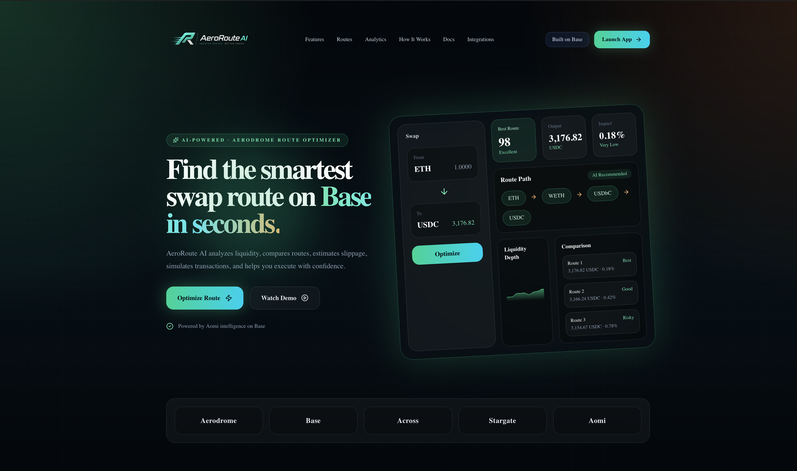
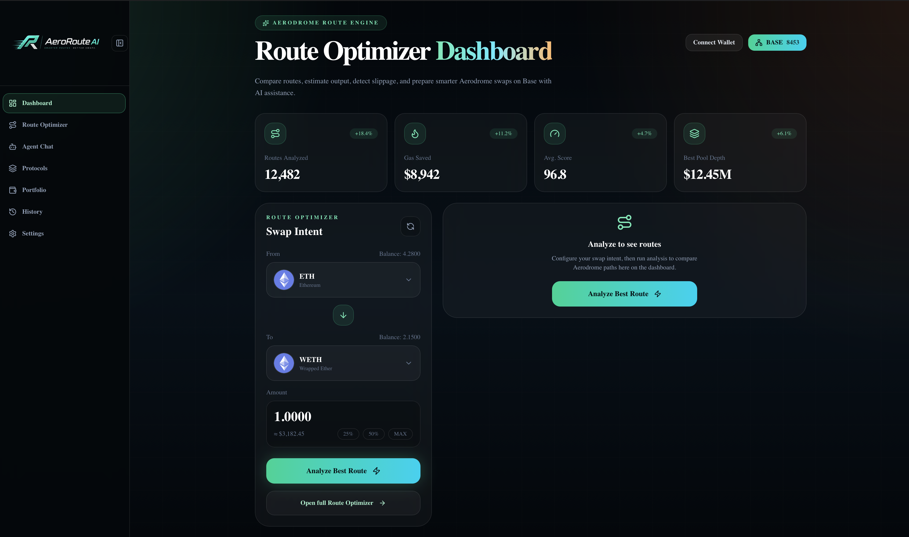
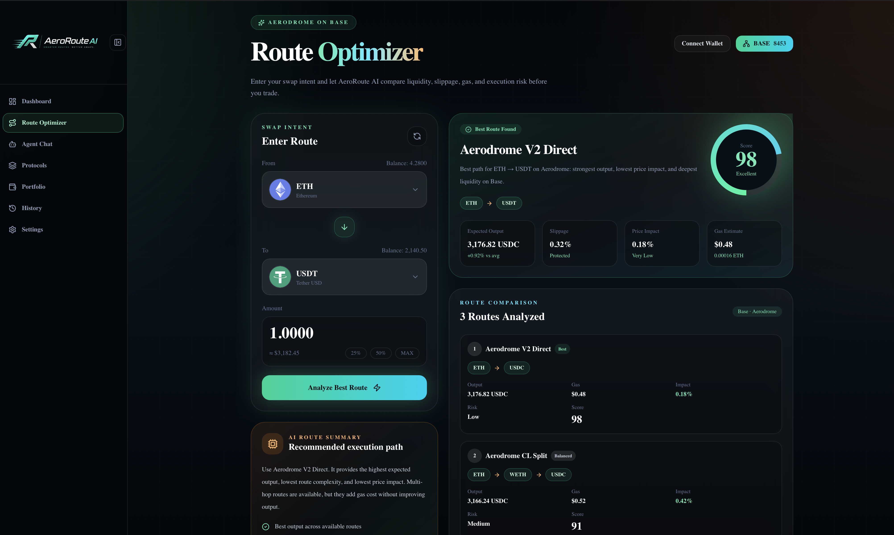
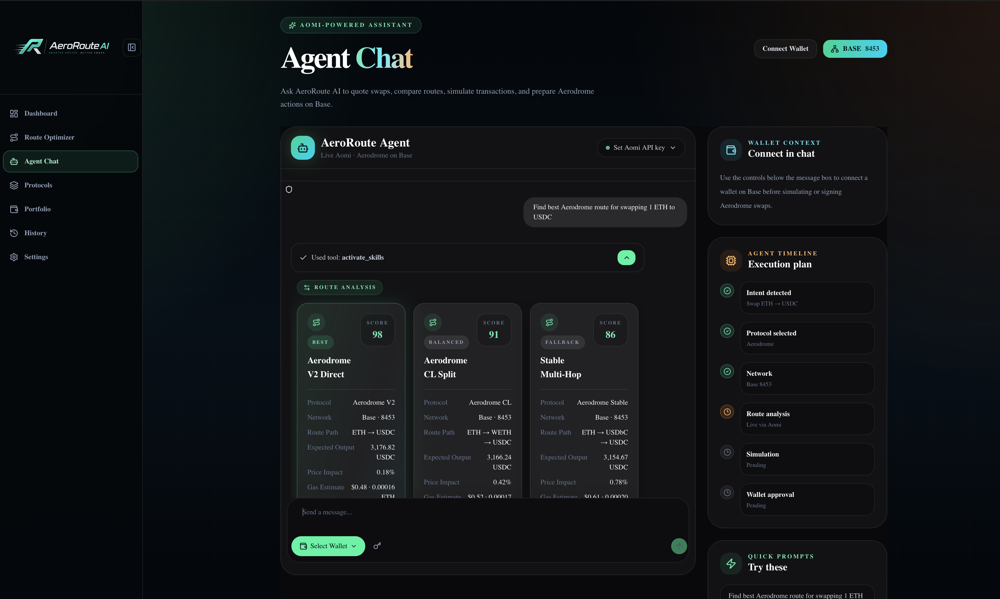
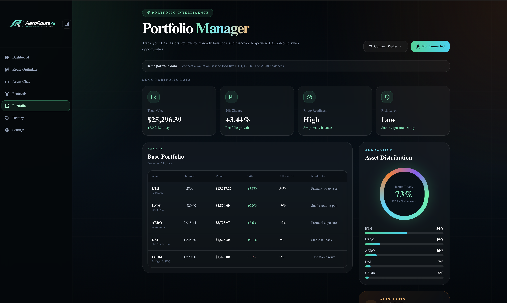
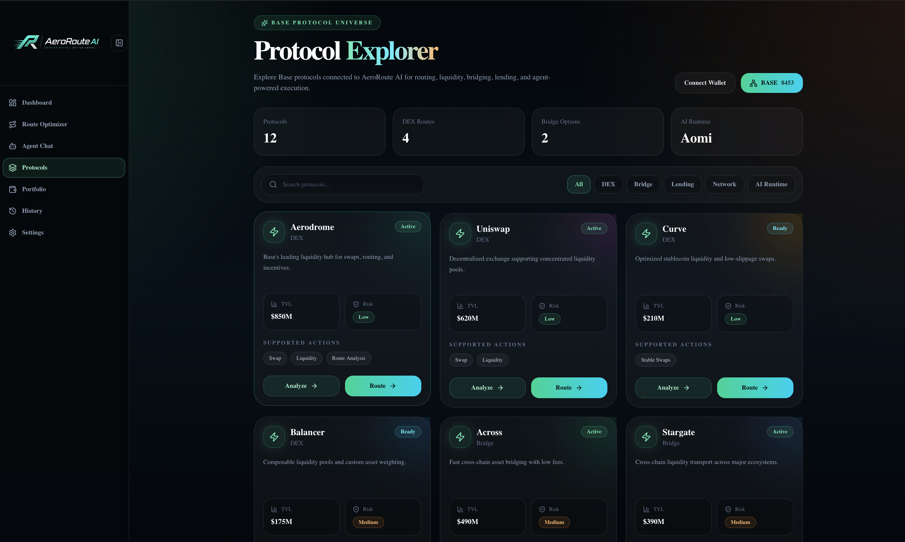
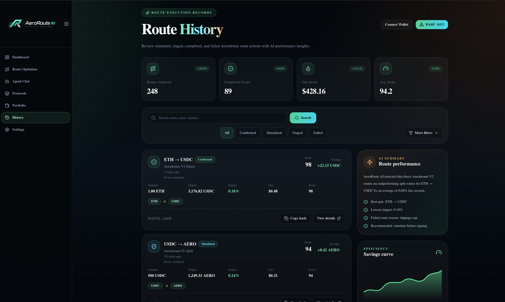
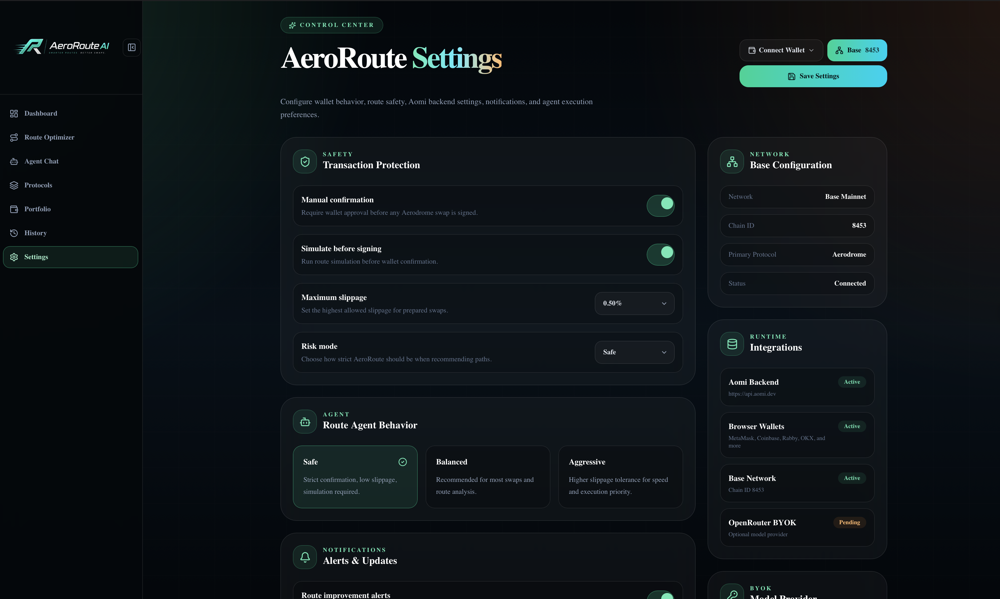

# AeroRoute AI

AI-powered route optimization for Aerodrome and Base.

AeroRoute AI helps traders discover the most efficient swap routes on Base through an intelligent routing engine, AI-assisted analysis, portfolio intelligence, and route execution insights. Instead of manually comparing pools, liquidity paths, gas costs, and price impact, users can ask AeroRoute AI for the best route and receive structured recommendations in seconds.

---

## Overview

Decentralized trading often requires users to compare multiple liquidity pools, route combinations, and execution paths before making a swap.

AeroRoute AI simplifies this process by combining:

- AI-powered route discovery
- Aerodrome-focused optimization
- Base ecosystem integrations
- Portfolio intelligence
- Route analytics and execution history

The platform provides a modern operating environment for discovering, analyzing, and preparing swaps on Base.

---

## Key Features

### Route Optimizer

Analyze and compare multiple swap paths before execution.

Features:

- Route scoring engine
- Price impact analysis
- Gas estimation
- Liquidity depth comparison
- Route confidence scoring
- Multi-path comparison

Supported route examples:

- Aerodrome V2 Direct
- Aerodrome CL Split
- Stable Multi-Hop Routes

### AI Agent Chat

Interact with AeroRoute AI using natural language.

Examples:

- Find the best route for swapping 1 ETH to USDC
- Compare Aerodrome routes
- Analyze price impact
- Simulate swap outcomes
- Review route quality

Features:

- Aomi integration
- Route result cards
- Execution planning
- Wallet-aware analysis
- Base network support

### Portfolio Intelligence

Monitor assets and identify route-ready opportunities.

Features:

- Live wallet balances
- Asset allocation overview
- Portfolio readiness score
- Route opportunity detection
- Portfolio health monitoring

Supported assets:

- ETH
- USDC
- AERO
- DAI
- Additional Base ecosystem assets

### Protocol Explorer

Discover protocols across the Base ecosystem.

Features:

- Protocol categories
- Liquidity insights
- Risk indicators
- Ecosystem overview
- Route compatibility information

### Route History

Review previous route activity and execution performance.

Features:

- Route filtering
- Search functionality
- Route status tracking
- Execution metrics
- Savings analysis
- AI-generated performance insights

### Settings & Controls

Customize route behavior and execution preferences.

Features:

- Risk profiles
- Slippage controls
- Notification preferences
- Agent behavior settings
- Network configuration
- Wallet management

---

## Technology Stack

### Frontend

- Next.js 16
- React 19
- TypeScript
- Tailwind CSS

### AI Layer

- Aomi
- OpenRouter

### Blockchain

- Base
- Wagmi
- Viem

### Wallets

- MetaMask
- Coinbase Wallet
- Browser Wallet

### Data Visualization

- Recharts

### State Management

- Zustand

---

## Architecture

```
User
  ↓
AeroRoute AI Interface
  ↓
AI Agent Layer (Aomi)
  ↓
Route Analysis Engine
  ↓
Base Ecosystem Protocols
  ↓
Aerodrome Liquidity
```

---

## Screenshots

### Landing Page



### Dashboard



### Route Optimizer



### Agent Chat



### Portfolio



### Protocol Explorer



### Route History



### Settings



---

## Installation

Clone the repository:

```bash
git clone https://github.com/BethelHills/aeroroute-ai.git
cd aeroroute-ai
```

Install dependencies:

```bash
npm install
```

Run locally:

```bash
npm run dev
```

Open [http://localhost:3000](http://localhost:3000) in your browser.

Production build:

```bash
npm run build
npm run start
```

---

## Environment Variables

Copy the template and create `.env.local` (gitignored):

```bash
cp .env.example .env.local
```

Example:

```env
NEXT_PUBLIC_BACKEND_URL=/api/aomi
AOMI_BACKEND_PROXY_TARGET=https://api.aomi.dev
AOMI_API_KEY=
OPENROUTER_API_KEY=
NEXT_PUBLIC_CHAIN_ID=8453
NEXT_PUBLIC_WALLETCONNECT_PROJECT_ID=
```

### Variable Reference

| Variable | Purpose |
| --- | --- |
| `NEXT_PUBLIC_BACKEND_URL` | Aomi backend URL for the browser. Use `/api/aomi` (same-origin proxy; recommended) or a full upstream URL. |
| `AOMI_BACKEND_PROXY_TARGET` | Upstream Aomi API when using `/api/aomi` (server-only; default `https://api.aomi.dev`). |
| `AOMI_API_KEY` | Aomi authentication key (`sk-...`). Powers agent chat when set; users can also enter a key in the UI. |
| `OPENROUTER_API_KEY` | Optional BYOK model provider (server-only; never use `NEXT_PUBLIC_`). |
| `NEXT_PUBLIC_CHAIN_ID` | EVM chain id — Base Mainnet (`8453`). |
| `NEXT_PUBLIC_WALLETCONNECT_PROJECT_ID` | WalletConnect project id (optional; enables WalletConnect in the wallet menu). |

For Vercel or other hosts, set the same variables in the project **Environment Variables** settings. `NEXT_PUBLIC_*` values are inlined at build time.

---

## Mobile Responsiveness

AeroRoute AI is fully responsive and tested across:

- 390px
- 430px
- 768px
- 1024px
- 1440px

Responsive features:

- Mobile navigation drawer
- Adaptive route cards
- Responsive analytics panels
- Mobile wallet interactions
- Responsive tables and charts

---

## Demo Flow

### 1. Connect Wallet

Connect MetaMask, Coinbase Wallet, or a supported browser wallet.

### 2. Open Route Optimizer

Analyze the best route for a swap.

### 3. Compare Available Paths

Review route score, gas cost, and price impact.

### 4. Open Agent Chat

Ask AeroRoute AI for route recommendations.

### 5. Review Route Result Cards

Compare execution quality and expected output.

### 6. Explore Portfolio

Analyze wallet balances and route readiness.

### 7. Review Route History

Inspect execution insights and savings performance.

---

## Future Roadmap

- Live route execution
- Cross-protocol routing
- Advanced portfolio intelligence
- AI trade automation
- Multi-chain support
- Real-time liquidity monitoring
- Advanced analytics dashboard

---

## Why AeroRoute AI

AeroRoute AI combines intelligent route optimization with conversational AI to simplify trading on Base.

Instead of manually comparing routes, users can interact with an AI assistant that understands liquidity, execution quality, price impact, and route efficiency.

The result is a faster, smarter, and more intuitive way to navigate DeFi on Base.

---

## License

MIT License
